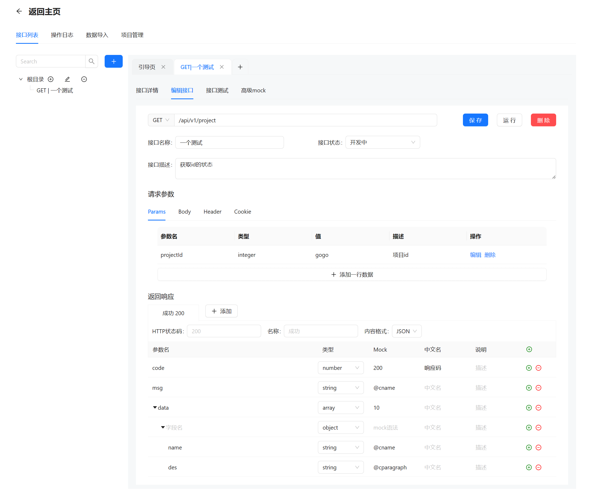
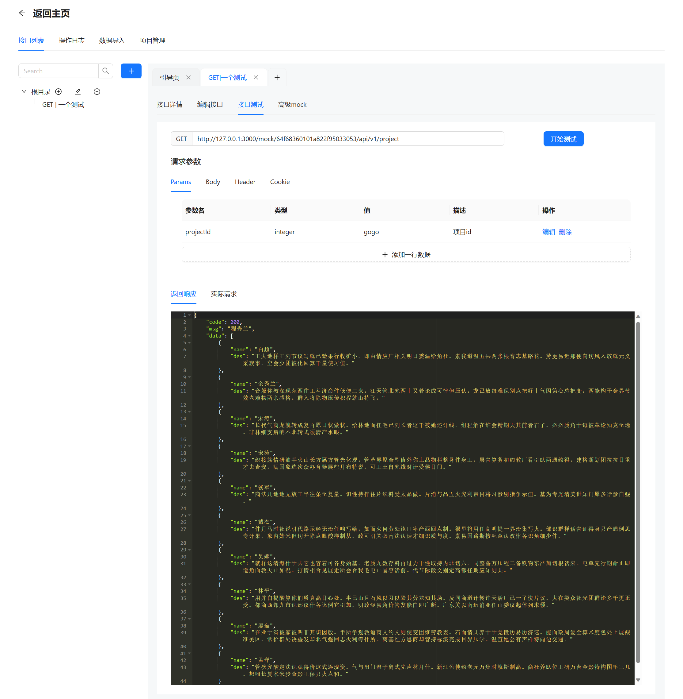
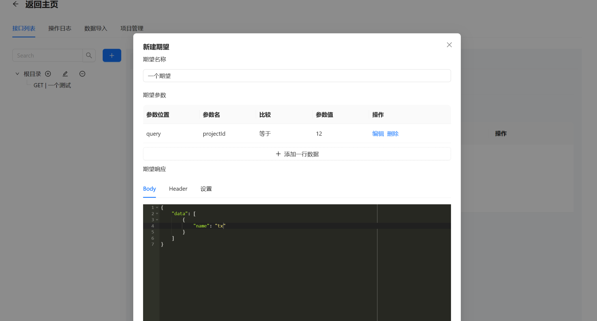

# HTTP 接口管理平台

后端地址：https://github.com/lossercode/apifox-backend (时间仓促还存在许多bug未改)

接口详情
- 支持多种请求方法
- 支持设置query、body、header、cookie参数
- 响应体支持数组、对象类型

接口测试
- 优先匹配用户的期望，没有命中期望则返回之前定义好的响应体
- 响应体按照mock语法进行生成

接口期望
- 期望：根据不同的参数返回不同的响应体
- 可以设置响应头、随机响应码

